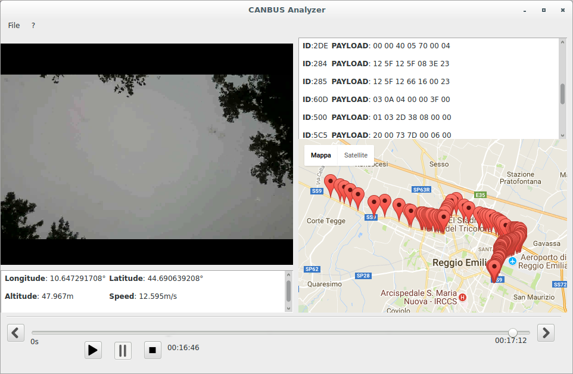

# canbus_sniffer_gui

This application rapresents the graphic user interface of the following projects: https://github.com/CorraMatte/buildroot-rpi3-sniffer. This GUI is supposed to import an archive given from the sniffer application, and show the data in a video player style application. In the followint image is possible to notice a screenshot of the GUI.

